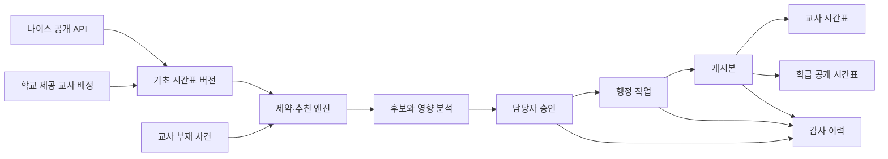

# 조율 변경 관제판·실데이터 프로토타입 상세 설계

- 작성일: 2026-08-18
- 상태: 사용자 승인 완료 · 단계 A 구현 계획 완료
- 기준 브랜치: `codex/product-rebuild`
- 선행 설계: [2026-08-18-product-rebuild.md](./2026-08-18-product-rebuild.md)

## 1. 결정 요약

조율은 “시간표에서 교체안을 찾는 도구”에서 **학교 시간표 변경 운영체제**로 확장한다.
하나의 변경 사건을 교사 요청, 충돌 검증, 담당자 승인, 행정 마감, 교사·학급 시간표 게시까지
이어 주는 것이 제품의 중심이다.

브라우저 프로토타입은 다음 문장을 실제 클릭으로 증명해야 한다.

> 한 번 결정하면, 영향받는 모든 시간표와 행정 상태가 함께 움직인다.

이번 단계에서는 실제 서버를 먼저 만들지 않는다. 공식 나이스 공개 데이터와 현실적인 합성 운영
데이터를 결합해, 데스크톱과 모바일에서 전체 사용자 여정과 상태 전파를 검증한다. 프로토타입이
아래 완료 기준을 통과한 뒤 학교별 공유 서버, 인증, 권한, 실시간 동기화가 있는 운영 단계로 간다.

## 2. 문제와 제품 기회

학교 시간표 변경은 수업 한 칸을 옮기는 작업이 아니다. 결강을 알게 된 교사는 가능한 방법을
찾고 협조를 구해야 한다. 일과 담당자는 학급, 교사, 선택과목, 특별실, 휴업일, 최근 보강 부담을
확인하고 승인한다. 그 뒤에도 나이스 반영, 교사 안내, 학급 게시, 결재 기록이 남는다.

기존 제품은 이 과정을 여러 화면과 프로그램으로 나눠 처리한다. 현재 조율은 가능한 교체안 탐색과
행정 체크리스트를 연결했지만, 아직 한 브라우저의 역할 전환 데모에 가깝다. 변경이 학교 전체에
전파되는 장면과 여러 요청을 동시에 운영하는 감각이 약하다.

조율의 기회는 더 많은 기능을 나열하는 데 있지 않다. 다음 세 가지를 동시에 해결하는 데 있다.

1. **판단:** 성립 가능한 교체·보강안을 계산하고 이유와 영향을 비교한다.
2. **조정:** 여러 수업과 사람을 하나의 사건으로 묶어 승인 가능한 계획으로 만든다.
3. **마감:** 승인된 결정을 행정 기록과 모든 사용자 시간표에 빠짐없이 반영한다.

## 3. 제품 원칙

### 3.1 시간표가 항상 기준 화면이다

요청서나 카드 목록이 시간표를 대신하지 않는다. 모든 변경은 원래 시간표와 변경 후 시간표의
차이로 보여 준다. 데스크톱에서는 주간 시간표와 작업 레일을 함께 두고, 모바일에서는 오늘의
교시 흐름을 먼저 보여 주되 주간 표를 한 번에 열 수 있어야 한다.

### 3.2 설명보다 비교를 먼저 한다

후보마다 같은 설명과 버튼을 반복하지 않는다. 방법, 협조 인원, 변경 수업 수, 학생 영향,
부담, 위험 신호를 행 단위로 비교한 뒤 선택한 안 하나만 자세히 설명한다.

### 3.3 모르는 값은 빈 값이 아니다

교사 배정, 마지막 교시, 휴업일, 이동수업 묶음이 불완전하면 해당 자리를 “비어 있음”으로
판정하지 않는다. 완전성을 증명하지 못한 자료로는 추천이나 게시를 진행하지 않는다.

### 3.4 자동화는 결정권을 빼앗지 않는다

엔진은 하드 제약을 통과한 후보와 추천 이유를 제시한다. 담당자는 다른 유효 후보를 선택하거나
보강으로 전환하고, 사유를 남겨 반려할 수 있다. 근거 없는 자동 승인과 검은 상자 점수는 만들지 않는다.

### 3.5 한 번 입력하고 여러 번 쓰게 한다

같은 변경 내용을 요청, 승인, 나이스 목록, 교사 공지, 학급 게시, 결재 문서에 다시 입력하지 않는다.
하나의 변경 사건에서 각 역할에 맞는 화면과 문서를 만든다.

### 3.6 공개 사실과 합성 사건을 섞어 속이지 않는다

실제 학교명, 학급, 날짜, 교시, 과목은 공식 나이스 자료로 사용할 수 있다. 공개 API에 없는
교사명, 부재, 교환 요청, 보강 부담, 승인 기록은 합성 데이터임을 명시한다. 실제 학교에 허구의
교사 사건을 귀속시키지 않는다.

## 4. 사용자와 핵심 업무

### 4.1 수업 교사

- 오늘 바뀐 수업이 있는지 5초 안에 확인한다.
- 한 교시 또는 하루 이상의 부재를 등록하고 영향을 받는 수업을 함께 본다.
- 추천된 교체·보강안을 비교해 요청한다.
- 승인 여부와 최종 시간표를 별도 연락 없이 확인한다.

### 4.2 협조 교사

- 자신에게 어떤 변경이 왜 오는지 확인한다.
- 원래 수업과 바뀐 수업, 학생·학급 영향을 한 화면에서 본다.
- 운영 단계에서는 수락·의견 기능을 사용하되, 프로토타입에서는 상태와 알림 도착을 검증한다.

### 4.3 일과 담당자

- 오늘과 가까운 날짜의 미해결 결원, 승인 대기, 행정 미완료 건을 우선순위로 본다.
- 여러 수업이 묶인 부재 사건을 수업별로 해결하되 전체 충돌을 한 번 더 검증한다.
- 교사가 고른 안을 승인하거나 다른 유효 후보와 보강안을 선택한다.
- 나이스 반영, 공지, 결재, 게시를 한 사건 안에서 끝낸다.

### 4.4 학급 시간표 열람자

- 설치나 로그인 없이 학급의 오늘·내일 시간표를 확인한다.
- 변경된 교시, 원래 수업, 게시 시각을 구분해 본다.
- 교사 부재 사유나 내부 승인 기록은 볼 수 없다.

## 5. 목표와 비목표

### 5.1 프로토타입 목표

1. 교사가 학교 진입 후 60초 안에 한 교시 변경 요청을 제출한다.
2. 일과 담당자가 요청 5건을 2분 안에 분류하고 최소 3건을 승인·반려한다.
3. 한 번의 승인으로 교사, 담당자, 학급 공개 시간표의 상태가 함께 바뀐다.
4. 하루 단위 부재의 여러 수업을 하나의 사건으로 묶어 처리한다.
5. 실제 나이스 데이터의 불완전·휴업·선택과목·실습 블록을 잘못된 빈 시간으로 읽지 않는다.
6. 320px 모바일부터 1440px 데스크톱까지 핵심 여정이 끊기지 않는다.

### 5.2 운영 단계 목표

1. 학교가 한 번 설정하면 일반 교사는 인증키나 파일 없이 최신 시간표를 본다.
2. 학교별 데이터와 권한이 완전히 격리된다.
3. 승인과 게시가 여러 기기에서 실시간으로 같은 상태를 보인다.
4. 모든 변경과 행정 작업에 감사 이력이 남는다.
5. 장애가 발생해도 마지막 게시 시간표와 미완료 작업을 복구할 수 있다.

### 5.3 이번 프로토타입의 비목표

- 기초시간표 자동 편성: 조율은 이미 운영 중인 시간표의 변경을 다룬다.
- 나이스에 직접 쓰기: 공식 쓰기 연동이 확인되기 전에는 입력 목록과 완료 확인까지만 제공한다.
- 학생 개인 선택과목 시간표: 공개 API에는 학생별 수강 정보가 없다.
- 실제 교사 개인정보가 들어간 공개 데모: 교사와 사건은 합성 데이터만 사용한다.
- 네이티브 앱과 푸시 알림: 먼저 반응형 웹과 제품 상태 전파를 검증한다.
- 불투명한 AI 자동 결정: 규칙, 후보, 영향, 감점 근거를 사람이 확인할 수 있어야 한다.
- 경쟁 서비스 파일·코드·화면·비공식 API 호환: 공식 자료와 학교 소유 자료만 사용한다.

## 6. 정보 구조

### 6.1 공통 진입

- `/`: 학교 검색, 받은 링크 열기, 예시 학교 체험
- `/school/:slug`: 학교의 역할별 진입점
- `/school/:slug/class/:grade/:class`: 읽기 전용 학급 시간표

프로토타입에서는 실제 라우팅 또는 동일한 전환 상태로 구현할 수 있지만, URL과 뒤로 가기 동작은
운영 제품처럼 설계한다.

### 6.2 교사 영역

- 오늘: 지금·다음 수업, 변경 알림, 요청 상태
- 주간: 전체 시간표와 변경 전/후 표시
- 변경 요청: 부재 범위, 영향 수업, 후보 비교, 요청 제출
- 내 요청: 처리 단계, 담당자 결정, 최종 반영 결과

### 6.3 일과 담당 영역

- 운영 관제판: 오늘의 결원, 변경, 위험, 미완료 행정
- 변경 사건: 요청 묶음, 수업별 해결안, 전체 충돌, 영향 범위
- 게시 센터: 나이스·공지·결재·학급 게시 체크
- 데이터 상태: 공식 시간표 동기화, 교사 배정 완성도, 휴업일, 자료 경고

## 7. 화면 설계

### 7.1 랜딩

첫 화면은 제품 설명보다 “어떻게 내 학교를 여는가”에 답한다.

- 주 행동: `우리 학교 시간표 열기`
- 입력: 학교명 검색 또는 받은 링크 붙여넣기
- 보조 행동: `일과 담당자로 시작`
- 즉시 체험: `예시 학교 둘러보기`
- 신뢰 문구: 공식 나이스 공개 자료와 학교가 제공한 자료만 사용

교사에게 인증키, 파일 형식, 교사 배정 설정을 보여 주지 않는다. 자료 준비는 담당자의 최초 설정에만
나온다. 예시 학교는 설명 없이도 “오늘 변경 확인 → 요청 → 담당 승인 → 학급 게시”를 시작할 수 있다.

### 7.2 교사 오늘 화면

상단에는 인사말 대신 다음 행동에 필요한 상태를 둔다.

- 현재 시각 기준 `지금 수업`, `다음 수업`, `오늘 변경 n건`
- 수업 카드가 아니라 가로 또는 세로 교시 레일
- 변경된 수업은 원래 수업을 작게 남기고 새 수업을 강조
- 승인 대기 수업은 확정 변경과 다른 점선 상태
- `변경 요청`은 항상 보이되 수업을 누르면 대상이 자동 선택

모바일에서는 오늘 교시가 첫 화면을 채운다. 주간 시간표는 `주간` 전환으로 연다. 요청을 시작하면
주간 표를 접고 선택한 수업과 후보 비교에 집중한다.

### 7.3 변경 요청

요청의 시작 단위는 “수업 한 칸”이 아니라 **부재 사건**이다.

1. 날짜 또는 기간과 업무상 사유 범주를 고른다.
2. 해당 기간에 영향을 받는 자신의 수업을 자동으로 묶어 보여 준다.
3. 한 교시만 요청하거나 여러 수업을 사건 하나로 제출할 수 있다.
4. 각 수업에는 추천안, 대안, 보강 후보, 해결 불가 상태가 표시된다.
5. 제출 전에 전체 영향과 협조 교사 수를 한 번 요약한다.

사유는 `업무상 부재`, `연수·출장`, `학교 행사`, `기타`만 저장한다. 건강 상태나 상세 진단을
요구하지 않는다. 자유 입력은 담당자에게 필요한 조정 메모로 한정한다.

### 7.4 후보 비교

기본 표의 열은 다음으로 고정한다.

| 열 | 내용 |
|---|---|
| 방법 | 빈 교시 이동, 맞교환, 연쇄 교환, 보강 |
| 협조 | 영향을 받는 교사 또는 수업 묶음 |
| 변경 | 움직이는 수업 단위 수 |
| 학생 영향 | 빈 교시, 늦은 하교, 같은 날 중복 가능성 |
| 부담 | 최근 보강·교환과 당일 수업량 |
| 상태 | 추천, 유효, 주의 필요 |

처음에는 상위 5개만 보여 준다. 행을 선택하면 시간표 위에서 이동 경로, 변경 전/후, 추천 근거를
보여 준다. 자세한 점수와 규칙 설명은 보조 정보로 접는다. 행동 버튼은 비교 표 아래 한 번만 둔다.

### 7.5 운영 관제판

담당자의 기본 화면은 요청 목록이 아니라 **오늘의 운영 상태**다.

- 오늘 수업 변경 수
- 해결되지 않은 결원 수업 수
- 승인 대기 사건 수
- 나이스 미반영 수
- 게시 대기 수
- 특정 교사 부담 집중 경고
- 공식 시간표 마지막 동기화와 자료 완전성

중앙에는 오늘의 교시 타임라인을 둔다. 변경이 있는 교시에 교사와 학급 영향을 점으로 표시한다.
왼쪽 사건 목록에서 하나를 고르면 오른쪽 상세가 바뀐다. 작은 화면에서는 사건 목록 → 상세 →
마감의 단계형 화면으로 바뀐다.

### 7.6 변경 사건 상세

상단은 상태와 위험을 요약한다.

- 요청자, 기간, 영향 수업 수, 긴급도
- 해결 완료/미완료 수업 수
- 겹치는 다른 변경 사건
- 자료 불완전 또는 휴업·선택과목·실습 경고

본문은 수업별 해결안과 전체 계획 두 층으로 나눈다. 담당자가 한 수업의 후보를 바꾸면 사건 전체를
다시 검증한다. 앞에서 승인한 해결안과 새 해결안이 교사·학급 충돌을 만들면 게시 단계로 갈 수 없다.

### 7.7 행정 마감과 게시

승인과 게시를 같은 뜻으로 쓰지 않는다.

1. 해결안 승인
2. 나이스 입력 목록 생성·확인
3. 교사 안내 확인
4. 학급 게시 미리보기
5. 결재 또는 내부 기록 확인
6. 게시

필수 단계가 끝나지 않으면 `게시`를 누를 수 없다. 다만 학교 규정에 따라 어떤 단계가 필수인지
담당자가 설정할 수 있도록 도메인에서는 정책으로 분리한다. 프로토타입에서는 나이스, 공지, 게시를
필수로 둔다.

### 7.8 공개 학급 시간표

- 학교명, 학년·반, 오늘/내일/주간 전환
- 변경된 교시에 `변경` 배지와 원래 과목
- 마지막 게시 시각
- 내부 사유, 교사 부담, 승인 메모는 숨김
- 아직 게시되지 않은 요청과 승인안은 절대 노출하지 않음

### 7.9 일과 담당자의 최초 설정

“교사는 바로 사용”을 만들려면 설정 부담이 사라지는 것이 아니라 **학교에서 한 번만 정확히**
일어나야 한다. 설정 여정은 다음 여섯 단계로 고정한다.

1. 학교명을 검색해 공식 학교 코드와 학교급을 찾는다.
2. 담당자 한 명이 자신에게 발급된 공식 API 키를 넣어 학기 전체 공개 시간표를 받는다.
3. 학급·요일·교시·학사일정 완전성 보고서를 확인한다.
4. 학교가 권한을 갖고 내보낸 교사별 시간표 파일을 넣거나, 과목·학급 묶음을 일괄 배정한다.
5. 미배정·동명이인·분반 의심 수업만 검토한다.
6. 개인 링크 또는 학교 참여 링크를 배포한다.

일반 교사는 API 키와 원본 파일을 보지 않는다. 프로토타입의 키는 담당자 세션 메모리에만 두고
브라우저 영구 저장소, 데모 파일, 로그, URL 기록, Git에는 남기지 않는다. 교사별 시간표 파일을
쓸 수 있으면 설정 목표는
5분 이내다. 파일이 없으면 필요한 수동 배정 수를 시작 전에 보여 주고, 같은 학년·같은 과목 일괄
배정과 미완성 저장을 제공한다. 배정이 덜 된 수업은 점유 상태로 남아 잘못된 추천에 쓰이지 않는다.

프로토타입은 실제 개인정보 파일을 요구하지 않고, 권한 있는 파일의 구조를 닮은 합성 샘플로 전체
설정을 시연한다. 운영 단계 출구 조건에는 학교가 직접 제공한 실제 파일 한 건의 형식 검증이 포함된다.

## 8. 시그니처 경험: 변경 파동

모든 변경 사건은 다음 단계를 갖는다.

```text
초안 → 요청됨 → 검토 중 → 해결안 승인 → 행정 진행 → 게시 준비 → 게시 완료
                    ↘ 반려          ↘ 수정 필요         ↘ 게시 취소
```

화면에는 복잡한 상태명을 그대로 늘어놓지 않고 역할별로 번역한다.

| 내부 단계 | 교사에게 보이는 말 | 담당자에게 보이는 말 | 학급 화면 |
|---|---|---|---|
| 요청됨/검토 중 | 확인 중 | 승인 대기 | 표시 없음 |
| 해결안 승인 | 변경 예정 | 행정 처리 필요 | 표시 없음 |
| 게시 준비 | 곧 반영 | 게시 가능 | 표시 없음 |
| 게시 완료 | 시간표 반영 완료 | 게시 완료 | 변경 표시 |
| 반려 | 요청 반려 | 반려 | 표시 없음 |

승인 또는 게시 순간에는 단순 토스트가 아니라, 영향을 받는 교사·학급·행정 항목이 함께 갱신되는
짧은 전파 표현을 보여 준다. 장식용 애니메이션이 아니라 “어디까지 반영되었는가”를 설명하는
시각적 피드백이어야 한다.

## 9. 핵심 사용자 여정

### 9.1 한 교시 변경

1. 교사가 오늘 시간표에서 수업을 누른다.
2. 날짜와 사유 범주를 확인한다.
3. 상위 추천안과 대안을 비교한다.
4. 한 안을 요청한다.
5. 담당자가 영향과 충돌을 확인하고 승인한다.
6. 행정 마감 후 게시한다.
7. 교사와 학급 시간표가 동시에 바뀐다.

### 9.2 하루 부재와 여러 수업

1. 교사가 하루 부재를 등록한다.
2. 그날 자신의 모든 수업이 한 사건에 묶인다.
3. 시스템은 수업별 교체·보강 후보를 계산한다.
4. 담당자는 해결된 수업과 남은 수업을 한눈에 본다.
5. 일부만 해결되면 전체 게시 대신 `부분 해결` 상태를 유지한다.
6. 모든 수업이 해결되고 전체 충돌 검증을 통과해야 게시할 수 있다.

### 9.3 선택과목 블록 또는 이동수업

1. 여러 교사·학급이 한 묶음인 수업을 고른다.
2. 묶음을 통째로 옮길 수 있는 안만 교체 후보에 나온다.
3. 후보가 3개 미만이면 보강안을 동시에 보여 준다.
4. 학년 전체 블록처럼 교체가 사실상 불가능하면 그 이유를 숨기지 않는다.
5. 담당자는 안전한 보강 또는 별도 운영 조치를 선택한다.

### 9.4 게시 후 수정

1. 이미 게시된 변경에 새 충돌이나 취소 사유가 생긴다.
2. 기존 기록을 삭제하지 않고 `수정 사건`을 만든다.
3. 변경 전 게시본과 새 계획의 차이를 다시 검증한다.
4. 새 게시가 완료되면 이전 게시본은 대체됨으로 남는다.

## 10. 공식 데이터 활용 전략

### 10.1 사용할 공식 API

출처는 나이스 교육정보 개방 포털 `https://open.neis.go.kr/`로 한정한다.

| 목적 | 엔드포인트 | 사용하는 값 |
|---|---|---|
| 학교 검색 | `schoolInfo` | 교육청 코드, 학교 코드, 학교명, 학교급 |
| 학급 목록 | `classInfo` | 학년도, 학년, 반, 과정·학과 |
| 학사일정 | `SchoolSchedule` | 날짜, 행사, 휴업 구분, 학년별 해당 여부 |
| 학교 계열 | `schulAflcoinfo` | 주야 과정, 계열 |
| 학교 학과 | `schoolMajorinfo` | 계열, 학과 |
| 시간표 강의실 | `tiClrminfo` | 학년도·학기·학년·계열·학과별 강의실 |
| 초등 시간표 | `elsTimetable` | 날짜, 학년, 반, 교시, 수업 내용 |
| 중학교 시간표 | `misTimetable` | 날짜, 학년, 반, 교시, 수업 내용 |
| 고등학교 시간표 | `hisTimetable` | 날짜, 과정·학과, 학년, 반, 교시, 수업 내용 |
| 특수학교 시간표 | `spsTimetable` | 특수학교 과정과 교시별 수업 내용 |
| 급식 | `mealServiceDietInfo` | 식사 구분, 날짜, 메뉴, 영양 정보 |

프로토타입 제품 범위는 중·고등학교다. 초등과 특수학교 엔드포인트는 어댑터 경계를 깨지 않도록
계약만 유지하고 화면 여정에는 넣지 않는다. 계열·학과·강의실 정보는 특성화고 구조와 특별실
경고를 보조하지만, 공개 값만으로 실제 수업 자원 점유를 확정하지 않는다. 급식은 교사 홈의 일상
유용성을 높일 수 있으나 변경 관제의 판단에는 필요하지 않아 P1로 둔다.

### 10.2 2026-08-18 재확인 결과

공식 API를 인증키 없이 직접 호출해 다음을 확인했다.

- 서울고등학교 2026-03-09 1학년 1반은 전체 6교시지만 응답 행은 5개였다.
- 부천공업고등학교 같은 날짜의 1학년 1반도 전체 6교시, 응답 5개였다.
- 대청중학교 같은 날짜의 1학년 1반도 전체 6교시, 응답 5개였다.
- 서울고등학교의 2026년 학급 정보와 3월 학사일정은 현재 조회되며, 입학식·시업식·공휴일의
  학년별 적용 여부가 별도 필드로 온다.
- 시간표 응답에는 교사 항목이 없다.

따라서 `list_total_count`와 받은 행 수가 다르면 자료를 열지 않는다. 5행만 받은 자료를 6교시가
빈 시간인 것처럼 그리는 것은 가장 위험한 실패다. 학교 전체를 불러오려면 공식 API 키가 필요하며,
브라우저 프로토타입에서는 담당자의 현재 세션 메모리에만 둔다.

제공받은 개발용 키로 같은 조건을 다시 호출해 다음을 추가 확인했다.

- 서울고등학교 2026-03-09 1학년 1반은 6행 전부 수신했다.
- 대청중학교 2026-03-09 1학년 1반도 6행 전부 수신했다.
- 서울고등학교 2026-03-09~13 학교 전체는 1,089행이었다. `pSize=1000`으로 1쪽 1,000행,
  2쪽 89행을 받아 전체 수와 일치했다.
- 부천공업고등학교는 학과 26개, 계열 1개, 2026년 1학기 강의실 23개가 별도 API에서 조회됐다.
- 2024학년도 시간표 조회는 `INFO-200`으로 자료 없음이 반환됐다.

따라서 전체 시간표는 1,000행 단위로 끝까지 페이지를 넘기고, 마지막에 받은 행 수와
`list_total_count`가 정확히 일치할 때만 완전한 버전으로 확정한다. 명세상 한 요청의 최대치는
1,000건이며, 요청 횟수는 제한 없음으로 표기되어도 일별 트래픽 초과 오류 `ERROR-337`이 정의되어
있으므로 호출을 학교·기간 단위로 묶고 재시도 폭주를 막는다.

### 10.3 학년도별 조회 경로

공식 안내에 따라 시간표 조회 경로를 다음처럼 고정한다.

| 자료 기간 | 경로 | 조율의 처리 |
|---|---|---|
| 2025학년도 이후 | 현재 시간표 엔드포인트 | P0 실데이터와 운영 동기화에 사용 |
| 2023년 8월~2024학년도 | API 조회 불가 | 빈 자료로 오인하지 않고 공식 데이터 공백으로 표시 |
| 2019년~2023년 7월 | `*Timetablebgs` 과거 엔드포인트 | 연구용 선택 경로, P0 제품에서는 사용하지 않음 |

2023년 8월~2024학년도 자료가 필요한 경우 KERIS `openinfo@keris.or.kr` 요청 경로를 안내한다.
프로토타입의 현실 코퍼스는 API로 재현 가능한 2025·2026학년도 자료를 우선한다.

### 10.4 실데이터와 합성 데이터의 경계

| 데이터 | 출처 | 데모 표시 |
|---|---|---|
| 학교·학급·날짜·교시·과목·학사일정 | 나이스 공개 API | `공식 공개 자료` |
| 교사 배정·근무 불가·특별실 정책 | 합성 또는 학교 제공 파일 | `예시 운영 자료` |
| 부재·교환 요청·보강 부담·승인 기록 | 합성 | `예시 사건` |
| 실제 학교의 현재 공개 시간표 | 실시간 API | 읽기 전용, 변경 요청 비활성 |
| 조율 예시학교 | 실데이터 패턴을 바탕으로 생성 | 전체 변경 여정 활성 |

실제 학교 탐색 모드에서는 공개된 학급 시간표와 자료 상태만 보여 준다. 교사 배정이 없는 상태에서
교체 추천을 만들어 내지 않는다. 전체 제품 데모는 여러 실제 학교의 구조적 패턴을 합성한
`조율 예시학교`에서 진행한다.

### 10.5 검증 코퍼스

공식 API 키를 발급받은 연구 환경에서 다음 코퍼스를 유지한다.

- 일반고 4곳: 공통과목 중심 1학년과 선택과목이 늘어나는 2·3학년
- 특성화고·마이스터고 4곳: 전문교과 별표, 연속 실습, 학과·분반 패턴
- 중학교 4곳: 비교적 단순한 학급 시간표와 요일별 교시 차이
- 각 학교에서 2025학년도와 2026학년도 중 수업이 온전히 적재된 10일 이상
- 학사일정에서 공휴일, 재량휴업, 학년 행사, 정기고사 후보 기간

원본 대량 응답은 연구용 로컬 자료로 두고 저장소에는 넣지 않는다. 저장소에는 API 계약을 검증하는
최소 응답 스냅샷, 출처·조회일·요청 조건 메타데이터, 그리고 개인 정보가 없는 합성 데모만 둔다.

2026-08-18에 일반·자율고 4곳, 특성화·마이스터고 4곳, 중학교 4곳의 완전한 수업 주간을 실제로
호출했다. 원시 12,145행 가운데 필수값이 빠진 행이 250개, 완전히 같은 중복 행이 393개였고,
정규화 뒤 고유한 유효 행은 11,502개였다. 이 수치는 모집단 통계가 아니라 데이터 품질 회귀 기준이다.

특성화·마이스터고 표본에서는 전문교과 표시 수업이 1,631행, 같은 과목이 3교시 이상 이어진 블록이
464개였다. 두 학교에서는 같은 학급·날짜·교시에 서로 다른 강좌가 함께 온 칸이 288개였다. 일반고와
중학교 표본에서는 3교시 이상 같은 과목 블록이 없었다. 따라서 직업계고 실습과 병렬 강좌는 예외적인
문자열이 아니라 별도 모델이 필요한 정상 운영 구조로 취급한다.

실측에서 다음 데이터 품질 규칙도 확정했다.

1. `CLASS_NM` 또는 `ITRT_CNTNT`가 없는 행은 총 행 수에는 포함되지만 수업이 아니다. 격리하고
   진단 수에는 포함하되 시간표와 추천에는 쓰지 않는다.
2. 날짜·과정·계열·학과·학년·반·교시·과목·강의실이 모두 같은 행은 하나로 중복 제거한다.
3. 같은 학급·날짜·교시에 서로 다른 과목 또는 강의실이 오면 하나를 임의로 고르지 않고 병렬 강좌
   묶음으로 보존한다.
4. 고등학교 학급 식별자는 `학년-반`만으로 만들지 않는다. 학교, 학년도, 주야 과정, 계열, 학과,
   학년, 반을 함께 쓴다. 서울공업고 표본은 단순 키로 4개 반이지만 전체 키로 27개 반이었고,
   대구공업고는 15개와 42개로 달랐다.
5. 특정 주에 자료가 0행이어도 학교에 시간표가 없다고 단정하지 않는다. 서울공업고와 대전중학교는
   3월 9일 주에는 0행이었지만 3월 16일 주에는 각각 1,130행과 397행이 조회됐다.

### 10.6 실데이터에서 반드시 추출할 사례

1. 같은 날 두 과목이 정확히 자리를 바꾼 사례
2. `[보강]` 표시가 특정 기간·과목에 집중된 사례
3. 학년별 과목 다양성이 크게 다른 사례
4. 여러 학급·과목이 같은 교시에 나타나는 분반 후보
5. 전문교과 실습이 2~4교시 연속된 사례
6. 한 칸에 여러 과목 문자열이 오는 사례
7. 휴업일과 학교 행사, 학년별 행사
8. 수요일 단축수업 등 요일별 마지막 교시가 다른 사례
9. 자료가 늦게 적재되거나 일부 학급·교시가 빠진 사례
10. 동일 과목명 표기 변형과 학급명 형식 차이
11. 필수 필드가 없는 빈 껍데기 행과 완전 중복 행
12. 같은 반 번호가 여러 학과에서 반복되는 직업계고 사례
13. 한 학급·교시에 여러 강좌가 병렬로 오는 사례

이 사례는 문서 설명으로 끝내지 않는다. 각각을 엔진 회귀 테스트, 화면 데모 사건, 오류 메시지의
입력으로 연결한다.

### 10.7 최신 자료 선택 규칙

현재 날짜의 자료가 방학, 미적재, 학기 전환 때문에 없을 수 있다.

1. 현재 학년도·학기의 최근 14일에서 완전한 수업일을 찾는다.
2. 없으면 현재 학년도에서 180일까지 거슬러 올라간다.
3. 그래도 없으면 전 학년도의 검증된 스냅샷을 사용한다.
4. 화면에는 `실시간`, `최근 공개 자료`, `2025 검증 자료`처럼 기준 시점을 명시한다.
5. 자료 시점이 바뀌어도 합성 운영 사건의 날짜를 실제 학교에 붙이지 않는다.

### 10.8 공개 API만으로 알 수 없는 것

공개 시간표에는 교사, 학생별 선택과목, 실제 특별실 점유, 부재, 승인 기록이 없다. 학사일정에
정기고사나 갑작스러운 재량휴업이 빠지는 학교도 있다. 이 값은 추정해서 채우지 않는다.

- 교사와 담당 수업: 학교가 제공한 파일 또는 담당자 배정
- 이동수업·합반: 명시적 묶음 또는 교사·과목·교시가 같은 확정 가능한 경우만 자동 결합
- 특별실: 학교 정책 입력 전에는 특별실을 옮기는 후보에 경고
- 학생별 선택과목: 개인 시간표 기능을 비활성화하고 학급·강좌 묶음으로만 처리
- 정기고사·갑작스러운 휴업: 담당자가 날짜 또는 학년을 운영 제외일로 잠금

공개 자료로 알 수 없는 현실을 “AI가 알아서 추론”하는 것은 이번 제품의 킥이 아니다. 무엇을 알고
무엇을 모르는지 드러내고, 모르는 상태에서는 위험한 자동화를 멈추는 것이 신뢰의 기반이다.

## 11. 도메인 모델

### 11.1 핵심 개체

- `SchoolWorkspace`: 학교, 역할, 정책, 활성 시간표 버전
- `BaseScheduleRevision`: 공식 시간표의 출처, 조회 조건, 적재 시각, 완전성, 체크섬
- `ClassIdentity`: 학교·학년도·과정·계열·학과·학년·반으로 만든 충돌 없는 학급 식별자
- `Lesson`: 날짜, 교시, 학급 식별자, 과목, 강의실, 담당 교사 또는 미배정 상태
- `ParallelLessonGroup`: 한 학급·교시에 여러 강좌가 함께 오는 분반·선택과목 묶음
- `AbsenceCase`: 요청자, 기간, 사유 범주, 영향 수업 묶음
- `ResolutionItem`: 수업 하나의 교체·연쇄·보강·별도 조치
- `Candidate`: 이동 묶음, 하드 제약 결과, 점수, 근거, 영향
- `AdminTask`: 나이스, 공지, 결재, 게시 단계와 완료 기록
- `Publication`: 어떤 시간표 버전에 어떤 변경 사건을 반영했는지 기록
- `AuditEvent`: 누가 언제 어떤 상태와 선택을 바꿨는지 기록

### 11.2 상태 모델

```text
draft
  → submitted
  → in_review
  → resolution_approved
  → admin_in_progress
  → ready_to_publish
  → published
```

별도 종료 상태는 `rejected`, `cancelled`, `superseded`다. 게시된 기록은 삭제하지 않는다. 수정은
새 사건으로 만들고 이전 사건을 `superseded`로 연결한다.

### 11.3 변경 적용 규칙

- 모든 후보는 자신이 계산된 `BaseScheduleRevision`을 기억한다.
- 승인 시 활성 버전이 바뀌었으면 후보를 다시 검증한다.
- 한 사건의 수업별 해결안은 합친 뒤 학교 전체 충돌을 다시 검사한다.
- 게시된 변경만 교사·학급 확정 시간표에 적용한다.
- 승인됐지만 미게시인 변경은 교사에게 `변경 예정`으로만 보이고 학급 공개 화면에는 보이지 않는다.
- 모르는 교사 배정이나 학급 점유는 빈 시간으로 간주하지 않는다.

## 12. 데이터 흐름과 시스템 경계



현재 순수 엔진은 유지한다. 화면 컴포넌트가 직접 로컬 저장소와 엔진을 동시에 조작하지 않도록
다음 경계를 둔다.

1. **데이터 소스:** 나이스 응답과 학교 제공 파일을 정규화한다.
2. **도메인 서비스:** 후보 계산, 사건 전체 검증, 상태 전이를 담당한다.
3. **저장소 인터페이스:** 브라우저 데모 저장소와 운영 서버 저장소를 교체할 수 있게 한다.
4. **화면 투영:** 교사, 담당자, 학급 공개 화면에 필요한 읽기 모델을 만든다.

프로토타입은 브라우저 저장소를 사용하지만 역할을 바꿀 때 동일한 사건과 게시본을 본다. 운영 단계는
동일 인터페이스 뒤에 학교별 서버 저장소와 실시간 이벤트 구독을 붙인다.

## 13. 현실 충돌과 실패 처리

| 상황 | 제품 동작 |
|---|---|
| 인증키 없이 5행만 수신 | 일부 시간표를 그리지 않고 완전성 오류와 해결 방법 표시 |
| 1,000행이 넘는 학교·기간 조회 | 전체 페이지를 수신하고 총 행 수가 일치한 뒤에만 버전 확정 |
| 2023년 8월~2024학년도 조회 | 자료 없음과 학교 무수업을 구분하고 공식 API 공백 안내 |
| 일별 트래픽 제한 | 즉시 반복 호출하지 않고 마지막 완전 버전과 재시도 시점 표시 |
| API에 해당 기간 자료 없음 | 빈 시간표가 아니라 미적재 상태, 최근 검증 자료 선택 제안 |
| 필수값 없는 응답 행 | 수업에서 제외하고 자료 진단에 누락 행 수 표시 |
| 완전히 같은 응답 행 반복 | 정규화 단계에서 하나로 중복 제거 |
| 같은 학급·교시의 서로 다른 강좌 | 병렬 강좌 묶음으로 보존하고 단일 수업처럼 이동 금지 |
| 특성화고 학과 간 같은 반 번호 | 과정·계열·학과를 포함한 전체 학급 식별자 사용 |
| 교사 배정 일부 누락 | 해당 수업은 점유로 유지하고 이동·보강 계산 대상에서 제외 |
| 휴업일 또는 공휴일 | 해당 날짜로 이동·보강 금지 |
| 학년 행사 | 영향 학년만 경고, 자동 휴업 판단은 하지 않음 |
| 요일별 교시 수 다름 | 존재하지 않는 교시를 이동 후보에서 제외 |
| 선택과목·분반 묶음 | 묶음 전체가 성립할 때만 이동, 후보가 적으면 보강 병렬 제시 |
| 전문 실습 보강 | 실습 담당 경험을 우선하고 일반교사 후보에는 강한 경고 |
| 다른 요청이 먼저 승인됨 | 활성 버전에서 후보 재검증, 충돌하면 승인 중단 |
| 게시 중 일부 작업 실패 | 게시본을 만들지 않고 완료된 행정 단계와 재시도 위치 유지 |
| 게시 후 취소 | 기록 삭제 없이 수정 사건을 만들고 재게시 |
| 브라우저 저장 불가 | 체험은 유지하되 저장 불가를 즉시 알리고 내보내기 제공 |
| 네트워크 끊김 | 마지막 게시본은 읽기 가능, 새 요청·승인은 연결 복구 전 보류 |

오류 문구는 원인을 숨긴 일반적인 “실패했습니다”가 아니라 다음 행동을 알려야 한다. 예를 들어
`6교시 중 5교시만 받아 추천을 중단했습니다. 공식 API 키를 넣고 다시 불러오세요.`처럼 수치와
해결 방법을 함께 쓴다.

## 14. 시각·상호작용 방향

### 14.1 시각 언어

- 배경: 따뜻한 종이색에 가까운 밝은 회색
- 본문: 짙은 잉크색
- 확정 행동: 코발트
- 변경과 주의: 코랄
- 안전한 검증과 완료: 청록
- 대기와 미완료: 중성 회색·점선

카드 테두리만 반복해 계층을 만들지 않는다. 시간표, 교시 타임라인, 비교 표, 상태 레일이 각자 다른
형태를 갖되 색의 의미는 일관되게 유지한다. 숫자와 교시는 고정 폭 숫자로 정렬한다.

### 14.2 모바일 원칙

- 첫 화면 높이 안에 오늘의 다음 수업과 변경 유무가 보인다.
- 주요 터치 대상은 최소 44px다.
- 작업 중에는 한 화면에 하나의 주 행동만 둔다.
- 표는 무조건 가로 스크롤시키지 않고 핵심 열을 행 요약으로 바꾼다.
- 하단 고정 행동이 내용이나 토스트를 가리지 않는다.
- 주간 시간표는 축소판이 아니라 요일 전환형 또는 필요한 날 중심으로 보여 준다.

### 14.3 접근성

- 색만으로 변경 상태를 구분하지 않는다.
- 모든 상태와 점수 아이콘에 텍스트 이름이 있다.
- 키보드로 수업 선택, 후보 비교, 승인, 게시를 완료할 수 있다.
- 포커스는 요청 제출, 승인, 게시 후 바뀐 상태 제목으로 이동한다.
- 동작 감소 설정에서는 전파 애니메이션을 즉시 상태 변경으로 대체한다.

## 15. 데모 시나리오

프로토타입에는 아래 사건이 처음부터 준비되어야 한다. 모든 사건은 실제 공개 자료에서 관측한 구조를
바탕으로 만들되 교사와 부재 내용은 합성한다.

1. **간단한 같은 날 맞교환:** 두 과목이 3·4교시를 바꾸고 바로 승인 가능
2. **하루 부재:** 4개 수업 중 2개 교체, 1개 보강, 1개 미해결
3. **선택과목 블록:** 학년 전체 묶음이라 교체 후보 0개, 보강으로 해결
4. **전문교과 연속 실습:** 3교시 블록을 쪼갤 수 없고 실습 경험자 보강 우선
5. **휴업일 충돌:** 겉보기에는 비어 있지만 학사일정 때문에 이동 불가
6. **불완전 API:** 전체 6행 중 5행만 받아 추천 차단
7. **동시 요청 충돌:** 먼저 승인된 사건 때문에 두 번째 후보가 무효가 되어 재추천
8. **게시 후 수정:** 협조 교사 사정 변경으로 새 사건을 만들어 게시본 대체
9. **직업계고 동명 반:** 같은 `2학년 1반`이 여러 학과에 있어도 서로 다른 학급으로 유지
10. **병렬 강좌와 중복 행:** 완전 중복은 제거하고 실제 병렬 강좌는 묶음으로 보존

예시 체험은 1번으로 시작한다. 관제판에는 2~8번을 함께 두어 제품의 깊이를 보여 준다.
9~10번은 화면 앞에 내세우기보다 데이터 상태와 회귀 테스트에서 반드시 통과시킨다.

## 16. 요구사항과 인수 기준

### 16.1 P0 — 프로토타입 필수

- 학교 검색과 예시 학교 진입
- 일과 담당자의 학교 검색, 공식 자료 완전성 확인, 합성 교사 배정, 참여 링크 생성
- 교사 오늘·주간 시간표와 변경 전/후 표시
- 한 교시와 하루 부재 사건 생성
- 교체·연쇄·보강 후보의 행 단위 비교
- 일과 담당 운영 관제판
- 담당자의 대안 선택, 승인, 반려
- 사건 전체 충돌 재검증
- 나이스·공지·게시 행정 체크
- 게시 전/후 교사·학급 화면의 동기화
- 읽기 전용 학급 시간표
- 8개 사용자 여정 데모와 2개 데이터 품질 회귀 사건
- 나이스 데이터 완전성 차단
- 저장 실패, 네트워크 실패, 자료 미적재 상태
- 데스크톱·모바일·키보드 전체 여정

### 16.2 P1 — 프로토타입 직후

- 협조 교사의 수락·의견
- 여러 사건 일괄 승인
- 담당자 필수 행정 단계 정책 설정
- 변경 공지 채널별 미리보기
- 기간별 보강 부담과 해결 시간 분석
- 데이터 상태 진단과 재동기화 기록
- 급식 정보의 교사 오늘 화면 표시

### 16.3 P2 — 운영 확장

- 학교 SSO 또는 초대 기반 계정
- 실제 실시간 알림
- 학생 개인 선택과목 시간표
- 특별실·교과교실 자원 제약
- 정기고사와 학년 단위 일괄 운영
- 나이스 공식 쓰기 연동이 허용될 경우 직접 반영

### 16.4 핵심 인수 기준

- Given 교사가 오늘 수업을 보고 있을 때, When 수업을 선택하면, Then 날짜·수업이 채워진 요청이 열린다.
- Given 일과 담당자가 학교를 처음 설정할 때, When 공식 시간표와 교사 배정을 불러오면, Then 완전성·미배정·동명이인·묶음 의심 수를 확인하고 나서만 참여 링크를 만들 수 있다.
- Given 후보가 여러 개일 때, When 비교 화면이 열리면, Then 설명·버튼이 후보마다 반복되지 않는다.
- Given 하루 부재에 수업이 4개일 때, When 사건을 열면, Then 해결 상태를 수업별·전체로 함께 본다.
- Given API가 6개 중 5개 행만 반환했을 때, When 불러오기가 끝나면, Then 추천 화면으로 진행하지 않는다.
- Given 선택과목 묶음 후보가 3개 미만일 때, When 결과가 표시되면, Then 보강 후보가 같은 비교 맥락에 나온다.
- Given 다른 사건이 먼저 승인되었을 때, When 오래된 후보를 승인하면, Then 재검증 후 충돌을 알리고 중단한다.
- Given 행정 필수 단계가 남았을 때, When 담당자가 게시하려 하면, Then 게시되지 않는다.
- Given 게시가 완료되었을 때, When 역할을 교사와 학급으로 바꾸면, Then 같은 변경 결과와 게시 시각이 보인다.
- Given 게시된 변경을 취소할 때, When 수정이 필요하면, Then 기존 기록을 삭제하지 않고 대체 사건을 만든다.
- Given 320px 화면일 때, When 교사 요청과 담당 승인 흐름을 수행하면, Then 가로 넘침이나 가려진 행동이 없다.

## 17. 검증 계획

### 17.1 데이터 계약 테스트

- 학교 검색, 학급, 학사일정, 중·고 시간표 응답의 필수 필드
- 정상 응답, 결과 없음, 오류 코드, 5행 제한, 타입 변형
- 1,000행 경계, 다중 페이지 결합, 중복 페이지, 총 행 수 불일치
- 2023년 8월~2024학년도 공식 API 공백
- 필수값 누락 행 격리와 완전 중복 제거
- 과정·계열·학과를 포함한 학급 식별자 충돌 0건
- 병렬 강좌를 단일 강좌로 축약하는 건수 0건
- 과목명 앞 `[보강]`, `*` 전문교과, 복수 과목 문자열 정규화
- 조회 시각, 적재 시각, 출처 메타데이터 보존

### 17.2 엔진 테스트

- 교사·학급 충돌, 휴업일, 요일별 교시 수, 근무 불가
- 빈 교시 이동, 2자 맞교환, 3자 연쇄, 보강
- 분반·합반·복수교사 묶음의 원자적 이동
- 미완성 교사 배정에서 거짓 빈 시간 0건
- 사건 여러 수업을 합친 뒤 전체 충돌 0건
- 현재 41학급 규모에서 사건 10건 재검증 1초 이내

### 17.3 시나리오 테스트

8개 사용자 여정 사건을 각각 시작부터 게시 또는 안전한 중단까지 자동화한다. 2개 데이터 품질 사건은
정규화부터 학급 식별과 묶음 생성까지 자동화한다. 실제 관측 사례와 연결된
테스트는 출처 메타데이터를 이름 또는 설명에 남긴다.

### 17.4 브라우저 테스트

- 교사 1교시 요청 → 담당 대안 선택 → 승인 → 행정 → 게시
- 하루 부재 4수업 → 부분 해결 → 최종 게시
- 묶음 수업 → 교체 부족 → 보강 승인
- 동시 요청 → 오래된 후보 승인 차단 → 재추천
- 게시 후 수정 → 새 게시본 반영
- 실제 학교 읽기 전용 불러오기 → 자료 완전성 표시

각 흐름을 1440px, 390px, 320px에서 확인한다. 키보드만으로도 첫 번째 흐름을 완료한다.

### 17.5 품질 관문

- 설정 검사, 타입 검사, 단위 테스트, 빌드, 브라우저 스모크 통과
- 주요 화면의 명도 대비 WCAG 2.1 AA
- 44px 미만 주요 터치 대상 0개
- 320px 가로 넘침 0개
- 사용자 행동 후 포커스 유실 0개
- 프로덕션 의존성 알려진 취약점 0개

## 18. 성공 지표

### 18.1 프로토타입 사용성

- 교사 첫 요청 완료율 90% 이상
- 합성 교사별 시간표 파일을 사용한 학교 최초 설정 5분 이하
- 한 교시 요청 중앙 완료 시간 60초 이하
- 담당자 요청 1건 검토·승인 중앙 시간 45초 이하
- 참여자가 승인과 게시의 차이를 설명하는 비율 90% 이상
- 변경 후 영향을 받는 교사·학급을 정확히 찾는 비율 90% 이상
- 휴업·미완성 자료에서 위험한 추천을 승인하는 비율 0%

### 18.2 현장 파일럿

- 학교 설정 후 일반 교사의 별도 자료 입력 0회
- 변경 공지를 따로 다시 작성하는 비율 20% 이하
- 승인 후 게시 누락 0건
- 나이스 입력 누락 0건
- 보강 부담 상위 교사 편중이 파일럿 전보다 감소
- 일과 담당자의 주간 변경 마감 시간 30% 이상 감소

## 19. 단계별 범위

### 단계 A — 경쟁력 있는 브라우저 프로토타입

- 정보 구조와 시각 체계 전면 개편
- 변경 사건과 게시본 중심의 브라우저 도메인 모델
- 실제 나이스 읽기 전용 경로와 합성 운영 레이어
- 교사, 담당자, 학급 공개 화면의 상태 전파
- 8개 사용자 여정 데모, 2개 데이터 품질 사건과 자동 검증

단계 A만 다음 구현 계획의 범위다. 단계 B와 C는 A의 검증 결과를 반영해 각각 별도 설계와 구현
계획을 작성한다. 이 구분 없이 공유 서버까지 한 번에 구현하지 않는다.

### 단계 B — 현장 리허설

- 3~5명의 현직 교사 또는 학교 업무 경험자와 과업 테스트
- 실제 학교가 권한을 갖고 제공한 교사 배정 파일 1건 검증
- 한 주간 발생한 변경 사건을 익명화해 재연
- 실패한 과업과 잘못 이해한 문구를 프로토타입에 재반영

### 단계 C — 운영 기반

- 학교별 공유 저장소와 역할 기반 접근 통제
- 버전이 있는 공식 시간표 동기화와 게시본
- 감사 로그, 백업·복구, 보존·삭제 정책
- 실시간 상태 구독과 알림
- 배포, 오류 추적, 상태 점검, 운영 문서

운영 단계의 서버는 공식 시간표의 정규화된 캐시와 출처 버전을 보관할 수 있어야 한다. 모든 교사가
자기 API 키를 넣게 하면 “학교 설정 한 번, 교사는 바로 사용”이라는 목표를 달성할 수 없기 때문이다.
교사 배정과 변경 사건은 공개 시간표와 분리해 학교별로 암호화·격리한다.

운영용 API 키는 서비스 운영자가 별도 심의승인을 받아 서버 비밀 저장소에서 관리한다. 나이스 약관상
발급 키는 발급받은 본인만 사용할 수 있고 타인에게 제공·공개·공유할 수 없으므로, 학교 담당자 키를
교사 브라우저로 전달하거나 배포 자바스크립트에 포함하지 않는다. 개발용 키도 로그·분석 도구·오류
보고서에 섞이지 않도록 URL과 요청 헤더를 마스킹한다.

이 결정은 기존 [운영 문서](../../../04-operations.md)의 “공식 시간표 본문을 서버에 두지 않는다”는
로컬 우선 가정을 운영 단계에서 수정한다. 실제 공유 제품에서는 모든 교사가 API 키를 갖지 않아도
동일한 게시본을 봐야 하므로, 출처·적재 시각·체크섬이 있는 최소 정규화 캐시가 필요하다.

## 20. 운영 단계로 넘어가는 출구 조건

다음 조건이 모두 충족되어야 실제 공유 서버 구현을 시작한다.

1. 8개 사용자 여정 데모가 데스크톱과 모바일에서, 2개 데이터 품질 사건이 엔진에서 자동으로 통과한다.
2. 공식 데이터의 부분 응답·휴업·교시 차이를 안전하게 막는다.
3. 교사, 담당자, 학급 열람자의 게시 상태가 하나의 사건에서 일관되게 파생된다.
4. 현장 리허설에서 교사 첫 요청 완료율 90% 이상을 달성한다.
5. 일과 담당자가 승인과 행정 마감을 혼동하지 않는다.
6. 실제 학교 제공 파일의 교사 배정을 최소 한 번 온전히 불러온다.
7. 개인정보 처리 항목, 목적, 보유 기간, 삭제, 위탁 범위를 운영 설계에 반영한다.

## 21. 결정 사항

- 제품 중심은 교사 요청함이 아니라 변경 관제판이다.
- 공개 학급 시간표를 프로토타입 P0에 포함한다.
- 한 교시뿐 아니라 하루 부재 사건을 P0에 포함한다.
- 실제 학교 모드는 읽기 전용이고, 전체 운영 데모는 합성 교사 사건을 사용한다.
- 공식 자료가 불완전하면 추천을 중단한다.
- 전체 시간표는 1,000행 단위 페이지를 모두 수신한 뒤 총 행 수를 대조한다.
- 핵심 실데이터는 조회 경로가 안정적인 2025·2026학년도를 사용한다.
- 급식은 P1이며 변경 판단에는 사용하지 않는다.
- 개발용 API 키는 세션 메모리, 운영용 키는 서버 비밀 저장소에서만 관리한다.
- 승인과 게시를 분리한다.
- 게시된 기록은 삭제하지 않고 수정 사건으로 대체한다.
- 운영 단계는 브라우저 로컬 저장을 공유 서버로 교체하되, 엔진과 도메인 규칙은 유지한다.

## 22. 근거 자료

- [나이스 교육정보 개방 포털](https://open.neis.go.kr/)
- [데이터·개인정보 사용 경계](../../data-and-privacy-boundary.md)
- [운영 실태와 데이터 경로](../../../03-domain-and-data.md)
- [현장 데이터 측정 기록](../../../05-field-measurement.md)
- [제품 재구축 설계](./2026-08-18-product-rebuild.md)
